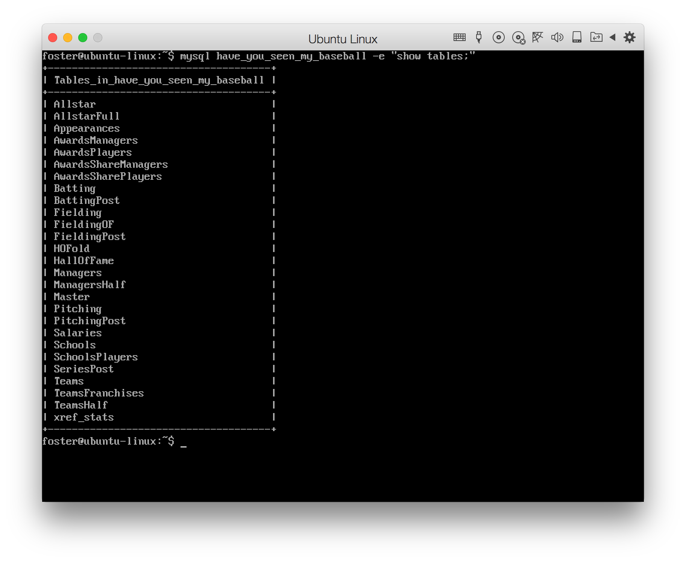

Use the appropriate SQL queries to find answers to the following questions:

1\. Find all of the Triple Crown (Award) winners ever in Major League Baseball, with their complete batting stats for the given year. Order the results in descending order first by batting average, then by RBIs, and lastly by home runs.

```SQL
-- these column names are so cryptic.
SELECT Batting.* FROM AwardsPlayers JOIN Batting USING (playerID, yearID) ORDER BY 'G_batting', 'RBI', 'HR',  DESC LIMIT 20;
```

    playerID	yearID	stint	teamID	lgID	G	G_batting	AB	R	H	2B	3B	HR	RBI	SB	CS	BB	SO	IBB	HBP	SH	SF	GIDP	G_old
    bondto01	1877	1	BSN	NL	61	61	259	32	59	4	3	0	30	NULL	NULL	1	15	NULL	NULL	NULL	NULL	NULL	61
    hinespa01	1878	1	PRO	NL	62	62	257	42	92	13	4	4	50	NULL	NULL	2	10	NULL	NULL	NULL	NULL	NULL	62
    heckegu01	1884	1	LS2	AA	78	78	316	53	94	14	8	4	42	0	NULL	10	NULL	NULL	2	NULL	NULL	NULL	78
    radboch01	1884	1	PRO	NL	87	87	361	48	83	7	1	1	37	NULL	NULL	26	42	NULL	NULL	NULL	NULL	NULL	87
    oneilti01	1887	1	SL4	AA	124	124	517	167	225	52	19	14	123	30	NULL	50	NULL	NULL	5	NULL	NULL	NULL	124
    keefeti01	1888	1	NY1	NL	51	51	181	10	23	3	0	2	8	3	NULL	4	56	NULL	0	NULL	NULL	NULL	51
    clarkjo01	1889	1	BSN	NL	73	73	262	36	54	9	3	2	23	8	NULL	11	59	NULL	0	NULL	NULL	NULL	73
    duffyhu01	1894	1	BSN	NL	125	125	539	160	237	51	16	18	145	48	NULL	66	15	NULL	1	NULL	NULL	NULL	125
    rusieam01	1894	1	NY1	NL	56	56	186	20	52	5	4	3	26	5	NULL	5	24	NULL	1	NULL	NULL	NULL	56
    lajoina01	1901	1	PHA	AL	131	131	544	145	232	48	14	14	125	27	NULL	24	NULL	NULL	13	1	NULL	NULL	131
    youngcy01	1901	1	BOS	AL	45	45	153	20	32	2	5	0	17	1	NULL	6	NULL	NULL	1	3	NULL	NULL	45
    wadderu01	1905	1	PHA	AL	46	46	116	4	20	3	1	0	10	0	NULL	4	NULL	NULL	0	6	NULL	NULL	46
    mathech01	1905	1	NY1	NL	44	44	127	13	30	5	0	2	16	2	NULL	10	NULL	NULL	3	1	NULL	NULL	44
    mathech01	1908	1	NY1	NL	56	56	129	11	20	2	2	0	11	0	NULL	9	NULL	NULL	2	7	NULL	NULL	56
    cobbty01	1909	1	DET	AL	156	156	573	116	216	33	10	9	107	76	NULL	48	NULL	NULL	6	24	NULL	NULL	156
    cobbty01	1911	1	DET	AL	146	146	591	147	248	47	24	8	127	83	NULL	44	NULL	NULL	8	11	NULL	NULL	146
    schulfr01	1911	1	CHN	NL	154	154	577	105	173	30	21	21	107	23	NULL	76	71	NULL	3	31	NULL	NULL	154
    speaktr01	1912	1	BOS	AL	153	153	580	136	222	53	12	10	90	52	NULL	82	NULL	NULL	6	7	NULL	NULL	153
    doylela01	1912	1	NY1	NL	143	143	558	98	184	33	8	10	90	36	NULL	56	20	NULL	2	13	NULL	NULL	143
    johnswa01	1913	1	WS1	AL	54	54	134	12	35	5	6	2	14	2	NULL	5	14	NULL	1	1	NULL	NULL	54

2\. Calculate the number of MVPs and Triple Crown winners by position ever in major league baseball.

```SQL
SELECT f.POS, COUNT(crown.playerID) as crowns, COUNT(mvp.playerID) AS mvps 
FROM Fielding f
LEFT JOIN AwardsPlayers crown ON (f.playerID = crown.playerID AND f.yearID = crown.yearID AND crown.awardID = "Triple Crown")
LEFT JOIN AwardsPlayers mvp ON (f.playerID = mvp.playerID AND f.yearID = mvp.yearID AND mvp.awardID = "MVP")
GROUP BY f.POS;
```

    POS   crowns	mvps
    1B    4    	    48
    2B    4	        18
    3B    1        	23
    C     0        	18
    CF    2    	    25
    DH    0    	    33
    LF    2	        26
    OF   18    	    68
    P    36    	    23
    RF    1    	    28
    SS    6    	    20


3\. Calculate the number of MVPs and Triple Crown winners by team ever in major league baseball.

```SQL
SELECT f.teamID, COUNT(crown.playerID) as crowns, COUNT(mvp.playerID) AS mvps 
FROM Fielding f
LEFT JOIN AwardsPlayers crown ON (f.playerID = crown.playerID AND f.yearID = crown.yearID AND crown.awardID = "Triple Crown")
LEFT JOIN AwardsPlayers mvp ON (f.playerID = mvp.playerID AND f.yearID = mvp.yearID AND mvp.awardID = "MVP")
GROUP BY f.teamID
HAVING (crowns > 0 OR mvps > 0);
```

    teamID	crowns	mvps
    ANA		0		3
    ARI		1		0
    ATL		0		11
    BAL		4		8
    BOS		7		21
    BRO		1		8
    BSN		7		2
    CAL		0		5
    CHA		0		7
    CHN		2		14
    CIN		1		28
    CLE		1		6
    COL		0		5
    DET		2		9
    HOU		0		3
    KCA		0		2
    LAN		3		6
    LS2		2		0
    MIN		1		10
    ML1		0		3
    ML4		0		6
    NY1		5		5
    NYA		6		39
    NYN		1		0
    OAK		0		15
    PHA		7		8
    PHI		4		8
    PIT		0		14
    PRO		7		0
    SDN		1		1
    SEA		0		7
    SFN		0		24
    SL4		1		0
    SLA		0		1
    SLN		3		27
    TEX		0		14
    TOR		2		5
    WS1		5		5


4\. Calculate the average batting average, RBIs, and home runs by position ever in major league baseball. Only consider seasons where a player had at least 300 at-bats (AB).
```SQL
-- A batting average is H / AB  (hits divided by at-bat)
SELECT f.POS, AVG(H/AB) as mean_batting_average, AVG(RBI) as mean_rbi, AVG(HR) as mean_home_runs
FROM Fielding f
INNER JOIN Batting b USING (playerID, yearID)
WHERE AB > 300
GROUP BY f.POS;
```

    POS		mean_batting_average	mean_rbi	mean_home_runs
    1B		0.27963278				67.3269		12.6591
    2B		0.26935185				50.1591		5.9463
    3B		0.27039775				57.0490		8.9848
    C		0.26825673				53.8253		8.8696
    CF		0.27335158				57.8432		13.1417
    DH		0.27632093				68.5713		16.7933
    LF		0.27416908				60.7898		14.4480
    OF		0.28034770				61.2095		11.1194
    P		0.27723888				55.0918		4.9859
    RF		0.27419109				63.1295		15.1630
    SS		0.26516182				50.9998		6.0784


5\. Return all player info for all players that won an MVP and a Gold Glove during their careers, along with the number of times they won each.

```SQL
-- "All player info" is ambiguous, so here's their batting stuff
SELECT b.playerID, COUNT(mvp.playerID) AS mvps, COUNT(glove.playerID) AS gloves, b.*
FROM Batting b
LEFT JOIN AwardsPlayers mvp ON (b.playerID = mvp.playerID AND b.yearID = mvp.yearID AND mvp.awardID = "MVP")
LEFT JOIN AwardsPlayers glove ON (b.playerID = glove.playerID AND b.yearID = glove.yearID AND glove.awardID = "Gold Glove")
GROUP BY b.playerID
HAVING (mvps > 0 AND gloves > 0);
```


    playerID	mvps	gloves	playerID	yearID	stint	teamID	lgID	G	G_batting	AB	R	H	2B	3B	HR	RBI	SB	CS	BB	SO	IBB	HBP	SH	SF	GIDP	G_old
    aaronha01	1	3	aaronha01	1954	1	ML1	NL	122	122	468	58	131	27	6	13	69	2	2	28	39	NULL	3	6	4	13	122
    bagweje01	1	1	bagweje01	1991	1	HOU	NL	156	156	554	79	163	26	4	15	82	7	4	75	116	5	13	1	7	12	156
    bankser01	2	1	bankser01	1953	1	CHN	NL	10	10	35	3	11	1	1	2	6	0	0	4	5	NULL	0	0	NULL	0	10
    benchjo01	2	10	benchjo01	1967	1	CIN	NL	26	26	86	7	14	3	1	1	6	0	1	5	19	0	0	1	1	4	26
    bondsba01	7	8	bondsba01	1986	1	PIT	NL	113	113	413	72	92	26	3	16	48	36	7	65	102	2	2	2	2	4	113
    boyerke01	1	5	boyerke01	1955	1	SLN	NL	147	147	530	78	140	27	2	18	62	22	17	37	67	5	1	1	5	6	147
    brettge01	1	1	brettge01	1973	1	KCA	AL	13	13	40	2	5	2	0	0	0	0	0	0	5	0	0	1	0	0	13
    caminke01	1	3	caminke01	1987	1	HOU	NL	63	63	203	10	50	7	1	3	23	0	0	12	44	1	0	2	1	6	63
    clemero01	1	12	clemero01	1955	1	PIT	NL	124	124	474	48	121	23	11	5	47	2	5	18	60	3	2	4	3	14	124
    dawsoan01	1	8	dawsoan01	1976	1	MON	NL	24	24	85	9	20	4	1	0	7	1	2	5	13	1	0	2	0	0	24
    foxne01		1	3	foxne01		1947	1	PHA	AL	7	7	3	2	0	0	0	0	0	0	0	1	0	NULL	0	0	NULL	0	7
    garvest01	1	4	garvest01	1969	1	LAN	NL	3	3	3	0	1	0	0	0	0	0	0	0	1	0	0	0	0	0	3
    gibsobo01	1	9	gibsobo01	1959	1	SLN	NL	21	21	26	1	3	2	0	0	1	0	0	0	10	0	0	1	0	0	21
    griffke02	1	10	griffke02	1989	1	SEA	AL	127	127	455	61	120	23	0	16	61	16	7	44	83	8	2	1	4	4	127
    henderi01	1	1	henderi01	1979	1	OAK	AL	89	89	351	49	96	13	3	1	26	33	11	34	39	0	2	8	3	4	89
    hernake01	1	12	hernake01	1974	1	SLN	NL	14	14	34	3	10	1	2	0	2	0	0	7	8	0	0	0	0	1	14
    howarel01	1	2	howarel01	1955	1	NYA	AL	97	97	279	33	81	8	7	10	43	0	0	20	36	5	1	1	4	4	97
    jenseja01	1	1	jenseja01	1950	1	NYA	AL	45	45	70	13	12	2	2	1	5	4	0	7	8	NULL	0	1	NULL	3	45
    larkiba01	1	3	larkiba01	1986	1	CIN	NL	41	41	159	27	45	4	3	3	19	8	0	9	21	1	0	0	1	2	41
    lynnfr01	1	4	lynnfr01	1974	1	BOS	AL	15	15	43	5	18	2	2	2	10	0	0	6	6	2	1	0	1	0	15
    mantlmi01	3	1	mantlmi01	1951	1	NYA	AL	96	96	341	61	91	11	5	13	65	8	7	43	74	NULL	0	2	NULL	3	96
    marisro01	2	1	marisro01	1957	1	CLE	AL	116	116	358	61	84	9	5	14	51	8	4	60	79	5	1	3	2	6	116
    mattido01	1	9	mattido01	1982	1	NYA	AL	7	7	12	0	2	0	0	0	1	0	0	0	1	0	0	0	1	2	7
    mauerjo01	1	2	mauerjo01	2004	1	MIN	AL	35	35	107	18	33	8	1	6	17	1	0	11	14	0	1	0	3	1	35
    mayswi01	2	12	mayswi01	1951	1	NY1	NL	121	121	464	59	127	22	5	20	68	7	4	57	60	NULL	2	1	NULL	11	121
    mcgeewi01	1	3	mcgeewi01	1982	1	SLN	NL	123	123	422	43	125	12	8	4	56	24	12	12	58	2	2	2	1	9	123
    morgajo02	2	5	morgajo02	1963	1	HOU	NL	8	8	25	5	6	0	1	0	3	1	0	5	5	0	0	0	0	0	8
    munsoth01	1	3	munsoth01	1969	1	NYA	AL	26	26	86	6	22	1	2	1	9	0	1	10	10	1	0	0	1	5	26
    murphda05	2	5	murphda05	1976	1	ATL	NL	19	19	65	3	17	6	0	0	9	0	0	7	9	0	0	0	0	0	19
    parkeda01	1	3	parkeda01	1973	1	PIT	NL	54	54	139	17	40	9	1	4	14	1	1	2	27	1	2	1	0	2	54
    pedrodu01	1	1	pedrodu01	2006	1	BOS	AL	31	31	89	5	17	4	0	2	7	0	1	7	7	0	1	1	0	1	31
    pendlte01	1	3	pendlte01	1984	1	SLN	NL	67	67	262	37	85	16	3	1	33	20	5	16	32	3	0	0	5	7	67
    pujolal01	3	1	pujolal01	2001	1	SLN	NL	161	161	590	112	194	47	4	37	130	1	3	69	93	6	9	1	7	21	161
    ripkeca01	2	2	ripkeca01	1981	1	BAL	AL	23	23	39	1	5	0	0	0	0	0	0	1	8	0	0	0	0	4	23
    robinbr01	1	16	robinbr01	1955	1	BAL	AL	6	6	22	0	2	0	0	0	1	0	0	0	10	0	0	0	0	0	6
    robinfr02	2	1	robinfr02	1956	1	CIN	NL	152	152	572	122	166	27	6	38	83	8	4	64	95	7	20	8	4	14	152
    rodrial01	3	2	rodrial01	1994	1	SEA	AL	17	17	54	4	11	0	0	0	2	3	0	3	20	0	0	1	1	0	17
    rodriiv01	1	13	rodriiv01	1991	1	TEX	AL	88	88	280	24	74	16	0	3	27	0	1	5	42	0	0	2	1	10	88
    rolliji01	1	3	rolliji01	2000	1	PHI	NL	14	14	53	5	17	1	1	0	5	3	0	2	7	0	0	0	0	0	14
    rosepe01	1	2	rosepe01	1963	1	CIN	NL	157	157	623	101	170	25	9	6	41	13	15	55	72	0	5	6	6	8	157
    sandbry01	1	9	sandbry01	1981	1	PHI	NL	13	13	6	2	1	0	0	0	0	0	0	0	1	0	0	0	0	0	13
    schmimi01	3	10	schmimi01	1972	1	PHI	NL	13	13	34	2	7	0	0	1	3	0	0	5	15	0	1	0	0	0	13
    shantbo01	1	11	shantbo01	1949	1	PHA	AL	33	33	37	2	7	0	0	0	2	0	0	5	6	NULL	1	3	NULL	0	33
    suzukic01	1	9	suzukic01	2001	1	SEA	AL	157	157	692	127	242	34	8	8	69	56	14	30	53	10	8	4	4	3	157
    torrejo01	1	1	torrejo01	1960	1	ML1	NL	2	2	2	0	1	0	0	0	0	0	0	0	1	0	0	0	0	0	2
    versazo01	1	2	versazo01	1959	1	WS1	AL	29	29	59	4	9	0	0	1	1	1	0	4	15	0	1	0	0	0	29
    walkela01	1	7	walkela01	1989	1	MON	NL	20	20	47	4	8	0	0	0	4	1	1	5	13	0	1	3	0	0	20
    willsma01	1	2	willsma01	1959	1	LAN	NL	83	83	242	27	63	5	2	0	7	7	3	13	27	5	0	3	0	3	83
    yastrca01	1	7	yastrca01	1961	1	BOS	AL	148	148	583	71	155	31	6	11	80	6	5	50	96	3	3	2	5	19	148
    yountro01	2	1	yountro01	1974	1	ML4	AL	107	107	344	48	86	14	5	3	26	7	7	12	46	0	1	5	2	4	107


6\. Calculate the number of world series, division titles, and league championships for all teams.

```SQL
select teamID, COUNT(WSWin) as num_world_wins, COUNT(LgWin) AS num_league_champs, COUNT(DivWin) AS num_division_wins
FROM Teams
GROUP BY teamID
-- artificial limit to reduce amount of data:
HAVING (num_world_wins + num_league_champs + num_division_wins) > 50
```

    teamID	num_world_wins	num_league_champs	num_division_wins
    ATL		43				43					40
    BAL		55				55					40
    BOS		105				108					40
    BRO		55				68					0
    BSN		56				77					0
    CAL		31				31					27
    CHA		105				108					40
    CHN		112				133					40
    CIN		106				119					40
    CLE		105				108					40
    DET		105				108					40
    HOU		47				47					40
    KCA		40				40					40
    LAN		51				51					40
    MIN		48				48					40
    ML4		27				27					27
    MON		35				35					35
    NY1		61				75					0
    NYA		105				106					40
    NYN		47				47					40
    OAK		41				41					40
    PHA		51				54					0
    PHI		112				126					40
    PIT		109				122					40
    SDN		40				40					40
    SEA		32				32					32
    SFN		51				51					40
    SLA		50				52					0
    SLN		105				117					40
    TEX		37				37					37
    TOR		32				32					32
    WS1		57				60					0


7\. Calculate the average salary (as a percentage of yearly average) of all MVPs ever in major league baseball.
```SQL
SELECT yearID,
    FORMAT(mean_mvp_salary / mean_salary, 2) AS mvp_salary_pct,
    FORMAT(mean_salary, 0) AS mean_salary,
    FORMAT(mean_mvp_salary, 0) AS mean_mvp_salary
FROM (
    SELECT yearID, AVG(Salary) as mean_salary
    FROM Salaries
    GROUP BY yearID
) t1
INNER JOIN (
    SELECT s.yearID, AVG(Salary) AS mean_mvp_salary
    FROM Salaries s
    INNER JOIN AwardsPlayers a ON (s.playerID = a.playerID AND s.yearID = a.yearID AND a.awardID = "MVP")
    GROUP BY (s.yearID)
) t2 USING (yearID)
GROUP BY (yearID)
```

    yearID	mvp_salary_pct	mean_salary		mean_mvp_salary
    1985	0.98			476,299			465,000
    1986	2.97			417,147			1,238,333
    1987	2.16			434,729			937,500
    1988	2.38			453,171			1,079,166
    1989	1.74			506,323			880,000
    1990	3.13			511,974			1,600,000
    1991	2.41			894,961			2,158,334
    1992	3.79			1,047,521		3,975,000
    1993	2.88			976,967			2,815,833
    1994	2.52			1,049,589		2,640,000
    1995	4.49			964,979			4,337,500
    1996	5.21			1,026,924		5,350,000
    1997	5.82			1,219,888		7,105,266
    1998	6.29			1,280,845		8,062,500
    1999	4.42			1,485,317		6,562,500
    2000	2.28			1,992,985		4,551,666
    2001	3.50			2,279,841		7,983,334
    2002	3.89			2,392,527		9,312,500
    2003	7.29			2,573,473		18,750,000
    2004	5.82			2,491,776		14,500,000
    2005	7.02			2,633,831		18,500,000
    2006	0.13			2,828,623		370,000
    2007	5.22			2,941,436		15,354,262
    2008	2.28			3,136,517		7,163,974
    2009	3.81			3,274,113		12,463,663


8\. Use the statistics available at Baseball-Reference to add Miguel Cabrera's 2012 Triple Crown season to your Database. Make sure to add the appropriate information to all relevant tables.

Try to solve as many of these problems as you can. Some might be quite complex, feel free to stop if you feel that you have a good handle on SQL.

Submit:

1\. Your queries :white_check_mark:

2\. Your results (truncated is fine for large resultsets) :white_check_mark:

3\. A screenshot of your DB tables on either the command line or in MySQL Workbench


